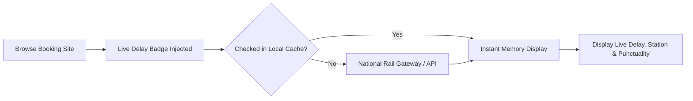
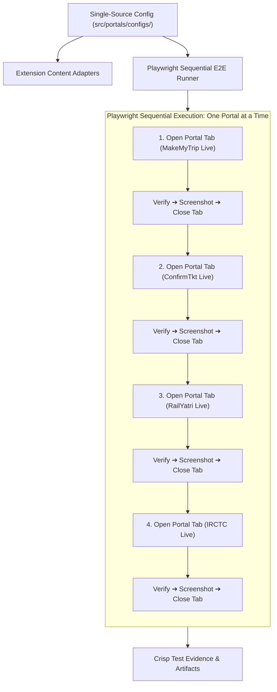

# 🚆 Live Train Delay Tracker — Real-Time Indian Railways Delay & Punctuality Extension

<p align="center">
  
  <br />
  <strong>Real-time Indian Railways live train running status, historical delay analytics, and punctuality ratings directly overlaid on ticket booking websites.</strong>
</p>

<p align="center">
  <a href="https://chromewebstore.google.com/detail/live-train-delay-tracker/cobgngjagafbacjpahojpbmpfhbknjnd"></a>
  <a href="https://microsoftedge.microsoft.com/addons/detail/live-train-delay-tracker/pknpnmpklieceipblhgfniafbcmpakao"></a>
  <a href="https://github.com/RajdipGhosh99/live-train-running-status-browser-extension/releases/latest"></a>
  <a href="https://github.com/RajdipGhosh99/live-train-running-status-browser-extension/blob/main/LICENSE"></a>
  
  
</p>

<p align="center">
  <a href="#-quick-install">Quick Install</a> •
  <a href="#-why-live-train-delay-tracker">Why This Extension?</a> •
  <a href="#-key-features">Features</a> •
  <a href="#-supported-booking-websites">Supported Websites</a> •
  <a href="#%EF%B8%8F-how-it-works">How It Works</a> •
  <a href="#-frequently-asked-questions-faq">FAQ</a> •
  <a href="#%EF%B8%8F-legal-disclaimer--trademark-notice">Legal & Disclaimer</a> •
  <a href="#-development">Development</a>
</p>

---

## ⚡ Quick Install

Install with a single click on your preferred Chromium browser:

### 🛍️ Official Web Stores (1-Click Install & Auto-Updates)

- **Google Chrome, Brave, Opera, Vivaldi, Arc:**  
  👉 **[Install from Google Chrome Web Store](https://chromewebstore.google.com/detail/live-train-delay-tracker/cobgngjagafbacjpahojpbmpfhbknjnd)**

- **Microsoft Edge:**  
  👉 **[Install from Microsoft Edge Add-ons](https://microsoftedge.microsoft.com/addons/detail/live-train-delay-tracker/pknpnmpklieceipblhgfniafbcmpakao)**

### 📦 Manual Sideload (Developer / Offline Install)
1. **Download:** Download the latest [`train-delay-tracker-v2.0.5.zip`](https://github.com/RajdipGhosh99/live-train-running-status-browser-extension/releases/latest/download/train-delay-tracker-v2.0.5.zip).
2. **Extract:** Unzip the archive into a permanent folder on your computer.
3. **Load in Browser:**
   - Open `chrome://extensions/` or `edge://extensions/`.
   - Enable **Developer mode** (toggle in the top-right corner).
   - Click **Load unpacked** and select the extracted folder.

---

## 💡 Why Live Train Delay Tracker?

When booking train tickets across popular travel portals (such as ConfirmTkt, MakeMyTrip, or Ixigo), travelers can see ticket availability and fares — but **not whether the train routinely runs 4 hours late**. Passengers often have to manually copy train numbers, switch between separate running status apps or NTES tabs, and check punctuality one train at a time.

**Live Train Delay Tracker bridges this gap.** It automatically places lightweight, interactive delay badges directly onto train cards on your search results page, giving you real-time running status and 30-day punctuality ratings *before* you book.

| Feature | Standard Booking Experience | With Live Train Delay Tracker |
| :--- | :---: | :---: |
| **Real-time Live Delay** | ❌ Not shown on booking list | ✅ **Instant live delay badge beside train** |
| **Current Physical Location** | ❌ Requires opening NTES / 3rd-party app | ✅ **Hover popover displays current station** |
| **Historical Punctuality** | ❌ Hidden or absent | ✅ **30-Day punctuality score percentage** |
| **Typical Delay by Day** | ❌ Unknown | ✅ **4-Week typical delay for today's day** |
| **Multi-Train Quick Fetch** | ❌ Manual 1-by-1 searching | ✅ **Floating HUD "Fetch All Delays" button** |
| **Direct Instant Lookup** | ❌ Not available | ✅ **Built-in 5-digit train popup search** |
| **Privacy & Telemetry** | ⚠️ Portal trackers & analytics | 🔒 **100% local, zero tracking, GPL-3.0** |

---

## ✨ Key Features

- 🇮🇳 **Authentic Indian Rail Identity:** Features a modern 2D vector emblem combining the Indian Tricolor canopy (Saffron & India Green), the Ashoka Chakra dial of punctuality, and an Emerald Live Status beacon.
- 🟢 **Live Running Status Overlay:** Interactive `[🚆 Check Live]` delay badges placed seamlessly beside train names on supported booking portals.
- 📊 **3-Metric Delay Analytics:**
  - **Today Live:** Real-time delay status and physical current station location.
  - **4-Week Typical:** Historical average delay for today's day of the week over the last month.
  - **Punctuality Score:** 30-day reliability rating percentage.
- 🎯 **Instant 5-Digit Train Lookup:** Enter any 5-digit Indian Railways train number directly into the extension popup for instant delay results without navigating to any booking site.
- 🎛️ **Floating Quick-Action HUD:** Convenient floating action button on search results to fetch all train delays on the page in a single click.
- 💾 **Data Saver & Strict 50 MB Cache:** Pure on-demand fetching. Caches checked train queries client-side to save mobile bandwidth and CPU with zero background polling.
- ⚡ **Zero-Config Gateway:** Works straight out of the box with public national rail endpoints, plus optional custom API key support (RapidAPI / IndianRailAPI) for advanced users.
- 🧩 **Customizable Badge Placement:** Choose whether delay badges appear beside the train name, below it, or pinned to the card header via the Settings page.

---

## 🌐 Supported Booking Websites

The extension automatically activates on major Indian Railways ticket booking websites:

| Booking Portal | Website Domain | Support Level |
| :--- | :--- | :---: |
| **ConfirmTkt** | `confirmtkt.com` | ✅ Native Full Support |
| **MakeMyTrip** | `makemytrip.com` | ✅ Native Full Support |
| **ClearTrip** | `cleartrip.com` | ✅ Native Full Support |
| **Ixigo** | `ixigo.com` | ✅ Native Full Support |
| **Goibibo** | `goibibo.com` | ✅ Native Full Support |
| **Paytm Travel** | `paytm.com` | ✅ Native Full Support |
| **EaseMyTrip** | `easemytrip.com` | ✅ Native Full Support |
| **RailYatri** | `railyatri.in` | ✅ Native Full Support |
| **Universal Scanner** | *Supported Railway portals* | ✅ Smart Auto-Detect |

---

## 🛠️ How It Works



1. **Detection:** When you search for trains on any supported booking site, the extension identifies train listings via resilient DOM adapters.
2. **On-Demand Query:** Clicking **Check Live** (or the floating **Fetch All Delays** button) queries real-time operational status for that train number.
3. **Smart Local Cache:** Responses are stored in your browser's private `chrome.storage.local` cache to prevent repeated network requests.
4. **Rich Decision Insight:** Color-coded status (`box-late`, `box-ontime`, `box-neutral`) and station location micro-banners help you book the most reliable train.

---

## 📦 Release History & Downloads

| Version | Release Date | Archive Package | Highlights | Release Notes |
| :--- | :---: | :---: | :--- | :---: |
| **`v2.0.5`** (Latest) | `2026-09-14` | [📥 `v2.0.5.zip`](https://github.com/RajdipGhosh99/live-train-running-status-browser-extension/releases/download/v2.0.5/train-delay-tracker-v2.0.5.zip) | Chrome Web Store compliance audit, native extension UI test suite (`popup.html` & `options.html`), IRCTC live autocomplete testing, Playwright speed optimizations | [Release Notes](https://github.com/RajdipGhosh99/live-train-running-status-browser-extension/releases/tag/v2.0.5) |
| **`v2.0.4`** | `2026-09-06` | [📥 `v2.0.4.zip`](https://github.com/RajdipGhosh99/live-train-running-status-browser-extension/releases/download/v2.0.4/train-delay-tracker-v2.0.4.zip) | Default auto-check all trains enabled, single-line HUD header title fix | [Release Notes](https://github.com/RajdipGhosh99/live-train-running-status-browser-extension/releases/tag/v2.0.4) |
| **`v2.0.3`** | `2026-09-06` | [📥 `v2.0.3.zip`](https://github.com/RajdipGhosh99/live-train-running-status-browser-extension/releases/download/v2.0.3/train-delay-tracker-v2.0.3.zip) | Settings tabs linking fix (`#providers`, `#caching`), scroll-spy sync, card decoupling | [Release Notes](https://github.com/RajdipGhosh99/live-train-running-status-browser-extension/releases/tag/v2.0.3) |
| **`v2.0.2`** | `2026-09-06` | [📥 `v2.0.2.zip`](https://github.com/RajdipGhosh99/live-train-running-status-browser-extension/releases/download/v2.0.2/train-delay-tracker-v2.0.2.zip) | HUD SPA auto-hide fix, Restore HUD popup action, Alt+H hotkey, launcher pill | [Release Notes](https://github.com/RajdipGhosh99/live-train-running-status-browser-extension/releases/tag/v2.0.2) |
| **`v2.0.1`** | `2026-09-06` | [📥 `v2.0.1.zip`](https://github.com/RajdipGhosh99/live-train-running-status-browser-extension/releases/download/v2.0.1/train-delay-tracker-v2.0.1.zip) | Indian Flag Squircle identity, modular Playwright E2E suite, layout fixes | [Release Notes](https://github.com/RajdipGhosh99/live-train-running-status-browser-extension/releases/tag/v2.0.1) |
| **`v2.0.0`** | `2026-09-05` | [📥 `v2.0.0.zip`](https://github.com/RajdipGhosh99/live-train-running-status-browser-extension/releases/download/v2.0.0/train-delay-tracker-v2.0.0.zip) | Manifest V3 complete rewrite, 50 MB strict cache limit, multi-portal engine | [Release Notes](https://github.com/RajdipGhosh99/live-train-running-status-browser-extension/releases/tag/v2.0.0) |
| **`v1.5.0`** | `2026-08-29` | [📥 `v1.5.0.zip`](https://github.com/RajdipGhosh99/live-train-running-status-browser-extension/releases/download/v1.5.0/train-delay-tracker-v1.5.0.zip) | Initial public release with 3-metric statistics and Quick Search popup | [Release Notes](https://github.com/RajdipGhosh99/live-train-running-status-browser-extension/releases/tag/v1.5.0) |

> 📜 **Complete Semantic Log:** View [CHANGELOG.md](CHANGELOG.md) for full commit diffs and historical notes.

---

## ⚙️ Customization & Settings

Open **Options / Settings** by clicking the gear icon ⚙️ in the popup or right-clicking the extension icon:
- **Badge Position:** Place badges beside the train name, underneath the title, or in the top-right corner.
- **Cache TTL (Time-To-Live):** Choose cache expiry (`0`, `1`, `5`, or `15` minutes) to balance fresh status updates with network savings.
- **Data Provider Selection:** Choose the primary gateway or configure custom RapidAPI / IndianRailAPI keys.
- **Portal Toggles:** Enable or disable badge injection on specific booking websites.
- **Storage Management:** View current cache memory consumption and clear cached data anytime with one click.

---

## ❓ Frequently Asked Questions (FAQ)

<details>
<summary><strong>1. Is Live Train Delay Tracker free to use?</strong></summary>
Yes, 100% free and open source under the GNU General Public License v3.0 (GPL-3.0). There are no subscriptions, ads, or paywalls.
</details>

<details>
<summary><strong>2. Does this extension work on Brave, Opera, Arc, or Vivaldi?</strong></summary>
Yes! Because it is built on modern Chromium Manifest V3, it installs seamlessly on Google Chrome, Microsoft Edge, Brave, Opera, Vivaldi, Arc, and other Chromium-based browsers via the <a href="https://chromewebstore.google.com/detail/live-train-delay-tracker/cobgngjagafbacjpahojpbmpfhbknjnd">Chrome Web Store</a>.
</details>

<details>
<summary><strong>3. Does the extension collect my personal booking or payment information?</strong></summary>
No. The extension strictly inspects only the public train number and station codes visible on the search results page to query running status. It never accesses your name, email, passwords, payment details, PNR numbers, or private user accounts. See our <a href="PRIVACY.md">Privacy Policy</a>.
</details>

<details>
<summary><strong>4. How is the 30-day punctuality score calculated?</strong></summary>
Historical punctuality ratings evaluate actual arrival and departure timings of the train across its route over the past 30 days. Trains arriving within 15 minutes of scheduled time are classified as on-time.
</details>

<details>
<summary><strong>5. Can I check train status without opening a booking website?</strong></summary>
Yes! Click the extension icon in your browser toolbar, enter any 5-digit train number (e.g. <code>12951</code>, <code>12301</code>) in the popup search box, and view live status instantly.
</details>

---

## 🔒 Privacy & Permissions

Live Train Delay Tracker is built with a **strict privacy-first architecture**:

- **No Remote Telemetry or Tracking:** Zero analytics, tracking pixels, or third-party behavioral trackers.
- **100% Local Execution:** Content scripts execute directly in your browser. Delay responses and user settings are stored locally in `chrome.storage.local`.
- **No Remote Code:** Strictly adheres to Google Chrome Web Store Developer Policies and Microsoft Edge Add-on Policies. All scripts and CSS are bundled locally in the extension package (no external `eval` or remote script loading).
- **Minimum Permissions Principle:** Only requests permissions strictly necessary for its advertised functionality (`storage`, `unlimitedStorage`, `tabs`, and active portal host permissions).

For full details, review our formal [PRIVACY.md](PRIVACY.md) policy.

---

## ⚠️ Legal Disclaimer & Trademark Notice

> [!IMPORTANT]
> **Please read this disclaimer carefully before using this software.**

1. **Independent Project & Non-Affiliation:**  
   **Live Train Delay Tracker** is an independent, non-commercial, community-driven open-source project developed by Rajdip Ghosh. It is **NOT** affiliated with, authorized by, endorsed by, maintained by, or in any way officially connected with:
   - **Indian Railways**, **Centre for Railway Information Systems (CRIS)**, or **National Train Enquiry System (NTES)**.
   - **IRCTC (Indian Railway Catering and Tourism Corporation)**.
   - Any commercial booking portal or Online Travel Agency (including **ConfirmTkt**, **MakeMyTrip**, **ClearTrip**, **Ixigo**, **Goibibo**, **Paytm Travel**, **EaseMyTrip**, or **RailYatri**).

2. **Trademark Notice:**  
   All product names, logos, brands, trademarks, and registered trademarks mentioned in this documentation, the extension, or its code are property of their respective owners. Their mention is strictly for **descriptive and nominative Fair Use** to identify compatibility and interoperability with publicly accessible web services.

3. **Informational Estimates & Traveler Responsibility:**  
   Live running status, arrival/departure delays, platform numbers, and historical punctuality metrics provided by this extension are informational estimates derived from public data sources and network gateways. Train operations, emergency stops, diversions, track maintenance, weather conditions, and railway signal changes can cause sudden schedule alterations.  
   **Always verify actual train departure and platform details with official railway station displays, station enquiry counters, or the official 139 railway helpline before boarding.**

4. **"AS-IS" Warranty & Limitation of Liability:**  
   This software is distributed under the GNU General Public License v3.0 on an **"AS IS" BASIS, WITHOUT WARRANTIES OR CONDITIONS OF ANY KIND**, either express or implied. Under no circumstances shall the author or contributors be liable for any direct, indirect, incidental, or consequential damages (including missed trains, missed connecting travel, ticket cancellation fees, or schedule disruptions) resulting from the use of this software.

5. **Acceptable Use & Anti-Scraping Policy:**  
   This extension is designed exclusively for individual passenger convenience. Automated batch scraping, unauthorized mass crawling, rate-limit circumvention, or denial-of-service activities against railway or third-party servers are strictly prohibited. See [DISCLAIMER.md](DISCLAIMER.md) for full terms.

---

## 💻 Development & Contribution

### Prerequisites
- **Node.js:** v18.0 or higher
- **npm:** v9.0 or higher

### Local Setup & Build
```bash
# Clone the repository
git clone https://github.com/RajdipGhosh99/live-train-running-status-browser-extension.git
cd live-train-running-status-browser-extension

# Install dependencies
npm install

# Start Vite live development server (with CRX HMR)
npm run dev

# Run TypeScript type check and production build
npm run build

# Package extension zip & generate SHA-256 checksums
npm run package

# Run unit tests (DOM parsing, regex, vendor configs)
npm run test

# Run native extension UI test suite (popup.html & options.html)
npm run test:ui

# Run Playwright real-site live booking portal E2E suite
npm run test:e2e:all
```

---

## 🧪 Automated Playwright Multi-Tab E2E Testing Framework

The extension utilizes an enterprise-grade, single-source E2E testing framework powered by **Playwright** (`@playwright/test`), verifying live production booking portals with zero mock fixture URLs:



### Key Architectural Highlights
- **Single Source of Truth (`src/portals/configs/`):** Portal URL schemas, DOM card selectors, badge anchors, and positioning rules are authored once in TypeScript and shared between extension content scripts and Playwright runners.
- **Sequential Tab Execution:** Runs live portal validation in isolated headful browser tabs, closing each tab upon completion to eliminate socket throttling, CDN rate-limiting, and memory bloat.
- **Badge Position Verification:** Verifies dynamic switching between `beside-name`, `card-header-right`, and `below-name` layouts with strict pixel tolerances ($\Delta Y \le 6\text{px}$).
- **Interactive UI Testing (`npm run test:ui`):** Inspects the running Service Worker to dynamically resolve the generated extension ID, verifying the Options Dashboard (`options.html`) and Quick Search Popup (`popup.html`).

---

## 📄 License

Distributed under the **GNU General Public License v3.0 (GPL-3.0)**.  
See the full [LICENSE](LICENSE) file for legal terms.

---

## 👤 Author & Maintainer

**Rajdip Ghosh**  
- **GitHub:** [@RajdipGhosh99](https://github.com/RajdipGhosh99)  
- **Chrome Web Store:** [Live Train Delay Tracker](https://chromewebstore.google.com/detail/live-train-delay-tracker/cobgngjagafbacjpahojpbmpfhbknjnd)  
- **Microsoft Edge Add-ons:** [Live Train Delay Tracker](https://microsoftedge.microsoft.com/addons/detail/live-train-delay-tracker/pknpnmpklieceipblhgfniafbcmpakao)  
- **Issue Tracker:** [Report a Bug or Suggest a Feature](https://github.com/RajdipGhosh99/live-train-running-status-browser-extension/issues)
