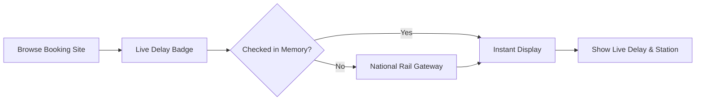
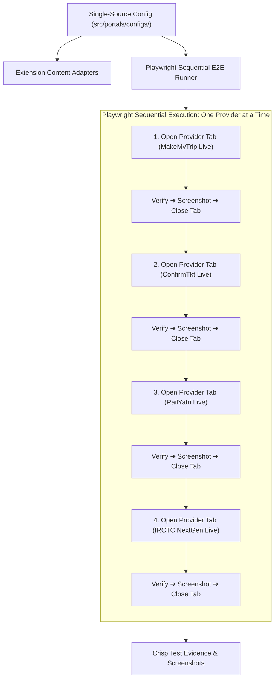

# 🚆 Live Train Delay Tracker

<p align="center">
  
  <br />
  <strong>Real-time Indian Railways live train running status and historical punctuality ratings directly on your favorite booking websites.</strong>
</p>

<p align="center">
  <a href="https://chromewebstore.google.com/detail/live-train-delay-tracker/cobgngjagafbacjpahojpbmpfhbknjnd"></a>
  <a href="https://microsoftedge.microsoft.com/addons/detail/live-train-delay-tracker/pknpnmpklieceipblhgfniafbcmpakao"></a>
  <a href="https://github.com/RajdipGhosh99/live-train-running-status-browser-extension/releases/latest"></a>
  <a href="https://github.com/RajdipGhosh99/live-train-running-status-browser-extension/blob/main/LICENSE"></a>
  
</p>

---

## ⚡ Quick Install

### Option 1: Chrome Web Store (Recommended for Chrome, Brave, Opera, Vivaldi)
Install with 1-click directly from the Google Chrome Web Store:  
👉 **[Add to Chrome from Chrome Web Store](https://chromewebstore.google.com/detail/live-train-delay-tracker/cobgngjagafbacjpahojpbmpfhbknjnd)**

### Option 2: Microsoft Edge Add-ons Store
Install with 1-click on Microsoft Edge:  
👉 **[Add to Edge from Microsoft Edge Add-ons](https://microsoftedge.microsoft.com/addons/detail/live-train-delay-tracker/pknpnmpklieceipblhgfniafbcmpakao)**

### Option 3: Manual Sideload (Developer / Offline)
1. **Download:** Grab the latest [`train-delay-tracker-v2.0.5.zip`](https://github.com/RajdipGhosh99/live-train-running-status-browser-extension/releases/latest/download/train-delay-tracker-v2.0.5.zip).
2. **Unzip:** Extract the archive into a permanent folder on your computer.
3. **Load:** Open `chrome://extensions/` (or `edge://extensions/`), enable **Developer mode** (top-right), click **Load unpacked**, and select the extracted folder.

### 📦 Release History & Downloads

| Version | Release Date | Archive Package | Highlights | Release Notes |
| :--- | :---: | :---: | :--- | :---: |
| **`v2.0.5`** (Latest) | `2026-09-14` | [📥 `v2.0.5.zip`](https://github.com/RajdipGhosh99/live-train-running-status-browser-extension/releases/download/v2.0.5/train-delay-tracker-v2.0.5.zip) | CWS Store compliance (removed unused scripting permission, minimum permissions audit), native extension UI test suite (`popup.html` & `options.html`), IRCTC live autocomplete testing, Playwright test speed & socket resilience optimizations | [Release Notes](https://github.com/RajdipGhosh99/live-train-running-status-browser-extension/releases/tag/v2.0.5) |
| **`v2.0.4`** | `2026-09-06` | [📥 `v2.0.4.zip`](https://github.com/RajdipGhosh99/live-train-running-status-browser-extension/releases/download/v2.0.4/train-delay-tracker-v2.0.4.zip) | Default auto-check all trains enabled, single-line HUD header title fix | [Release Notes](https://github.com/RajdipGhosh99/live-train-running-status-browser-extension/releases/tag/v2.0.4) |
| **`v2.0.3`** | `2026-09-06` | [📥 `v2.0.3.zip`](https://github.com/RajdipGhosh99/live-train-running-status-browser-extension/releases/download/v2.0.3/train-delay-tracker-v2.0.3.zip) | Settings tabs linking fix (`#providers`, `#caching`), scroll-spy sync, card decoupling | [Release Notes](https://github.com/RajdipGhosh99/live-train-running-status-browser-extension/releases/tag/v2.0.3) |
| **`v2.0.2`** | `2026-09-06` | [📥 `v2.0.2.zip`](https://github.com/RajdipGhosh99/live-train-running-status-browser-extension/releases/download/v2.0.2/train-delay-tracker-v2.0.2.zip) | HUD SPA auto-hide fix, Restore HUD popup action, Alt+H hotkey, launcher pill | [Release Notes](https://github.com/RajdipGhosh99/live-train-running-status-browser-extension/releases/tag/v2.0.2) |
| **`v2.0.1`** | `2026-09-06` | [📥 `v2.0.1.zip`](https://github.com/RajdipGhosh99/live-train-running-status-browser-extension/releases/download/v2.0.1/train-delay-tracker-v2.0.1.zip) | New Indian Flag Squircle vector identity, modular Playwright E2E suite, layout fixes | [Release Notes](https://github.com/RajdipGhosh99/live-train-running-status-browser-extension/releases/tag/v2.0.1) |
| **`v2.0.0`** | `2026-09-05` | [📥 `v2.0.0.zip`](https://github.com/RajdipGhosh99/live-train-running-status-browser-extension/releases/download/v2.0.0/train-delay-tracker-v2.0.0.zip) | Manifest V3 complete rewrite, 50 MB strict cache limit, multi-portal engine | [Release Notes](https://github.com/RajdipGhosh99/live-train-running-status-browser-extension/releases/tag/v2.0.0) |
| **`v1.5.0`** | `2026-08-29` | [📥 `v1.5.0.zip`](https://github.com/RajdipGhosh99/live-train-running-status-browser-extension/releases/download/v1.5.0/train-delay-tracker-v1.5.0.zip) | Initial public release with 3-metric statistics and Quick Search popup | [Release Notes](https://github.com/RajdipGhosh99/live-train-running-status-browser-extension/releases/tag/v1.5.0) |

> 📜 **Detailed Changelog:** Review [CHANGELOG.md](CHANGELOG.md) for the complete semantic change log and commit diffs across all versions.

---

## ✨ Features

- 🇮🇳 **Refreshed Indian Rail & Tricolor Identity:** Features an authentic, modern 2D vector emblem combining the Indian Tricolor canopy (Saffron & India Green), the Ashoka Chakra dial of punctuality, and a glowing Emerald Live Status beacon.
- 🟢 **Live Delay Badges:** Interactive `[🚆 Check Live]` delay badges placed seamlessly beside train names on booking portals.
- 📊 **3-Metric Delay Analytics:**
  - **Today Live:** Current real-time delay status and live station arrival/departure.
  - **4-Week Typical:** Historical average delay for today's day of the week over the last month.
  - **Punctuality Score:** 30-day reliability rating percentage.
- 🎯 **Instant Train Lookup:** Enter any 5-digit train number in the extension popup to check its live status instantly without opening a booking site.
- 🎛️ **Floating Quick-Action Button:** Convenient button on search results to fetch all train delays on the page in a single click.
- 💾 **Data Saver & Strict 50 MB Cache:** On-demand fetching only. Remembers checked trains to save mobile data and battery with zero background tracking.
- ⚡ **Out-of-the-Box National Rail Gateways:** Connects directly to real-time train feeds with zero setup, plus optional backup API key support for power users.

---

## 🌐 Supported Booking Websites

| Booking Portal | Website | Integration |
| :--- | :--- | :---: |
| **ConfirmTkt** | `confirmtkt.com` | ✅ Full Support |
| **MakeMyTrip** | `makemytrip.com` | ✅ Full Support |
| **ClearTrip** | `cleartrip.com` | ✅ Full Support |
| **Ixigo** | `ixigo.com` | ✅ Full Support |
| **Goibibo** | `goibibo.com` | ✅ Full Support |
| **Paytm Travel** | `paytm.com` | ✅ Full Support |
| **EaseMyTrip** | `easemytrip.com` | ✅ Full Support |
| **RailYatri** | `railyatri.in` | ✅ Full Support |
| **Universal Scanner** | *Any railway portal* | ✅ Auto-Detect |

---

## 🛠️ How It Works



1. When you search for tickets on any supported booking site, the extension automatically identifies train listings.
2. Click **Check Live** (or use **Fetch All Delays**) to retrieve the current running delay and station location.
3. Live results are displayed directly on the train card so you can pick the most punctual train before booking.

---

## ⚙️ Customization & Settings

Open **Settings** by clicking the gear icon ⚙️ in the extension popup or via browser extensions menu:
- **Badge Placement:** Choose whether badges appear beside the train name, below it, or in the top-right corner.
- **Data Saver Memory:** Customize how long checked trains are remembered (`0`, `1`, `5`, or `15` minutes).
- **Backup Data Sources:** Add optional RapidAPI or IndianRailAPI backup keys for automatic failover.
- **Site Controls:** Enable or pause badges for specific booking sites.

---

## 💻 Development

### Prerequisites
- Node.js (v18+)
- npm (v9+)

### Getting Started
```bash
# Clone the repository
git clone https://github.com/RajdipGhosh99/live-train-running-status-browser-extension.git
cd live-train-running-status-browser-extension

# Install dependencies
npm install

# Start development server
npm run dev

# Run type checks and build
npm run build

# Package extension zip & SHA-256 checksums
npm run package

# Run unit tests (DOM parsing, regex, vendor configs)
npm run test

# Run native extension UI test (popup.html & options.html)
npm run test:ui

# Run Playwright real-site live booking portal suite across all 9 portals
npm run test:e2e:all
```

---

## 🧪 Automated Playwright Multi-Tab E2E Testing & Single-Source Architecture

The extension features a comprehensive, high-performance E2E testing framework powered by **Playwright** (`playwright`) testing real live production websites without mock fixture URLs:



### 1. Single Source of Truth (`src/portals/configs/`)
- All portal URL templates, DOM selectors (cards, titles, anchors), badge positioning rules, and popup interaction parameters are defined once in `src/portals/configs/` (`types.ts`, `routing.ts`, `*.config.ts`).
- Imported directly by both the extension runtime adapters and the E2E test runner, eliminating duplicate configurations.

### 2. Live Sequential Execution & Validation (One Provider at a Time)
- **Isolated Headful Browser Tabs:** Opens one provider at a time in headful Chromium, verifies all test cases, captures screenshot evidence, and closes the tab before proceeding to the next provider. This prevents CDN socket throttling, memory bloat, and tab clutter.
- **Dynamic Badge Position Switching:** Every provider is automatically verified across all 3 supported badge positions:
  - `beside-name`: Positioned inline beside train title with pixel-perfect alignment ($\Delta Y \le 6\text{px}$).
  - `card-header-right`: Positioned in card header or right-aligned.
  - `below-name`: Positioned directly underneath the train title.
- **Dedicated Hover Popover Interactivity:**
  - Standardized color system: `box-late` (crimson red) for delayed status, `box-ontime` (emerald green) for on-time status, and `box-neutral` (mature slate) for 4-week typical runs and punctuality ratings.
  - Formatted strictly as 24-hr clock duration (e.g. `04:49` or `00:00`) with zero raw minute counts (`289m Late`).
  - Clean physical station location micro-banner with zero redundant delay text.
  - Action footer featuring compact 24-hour update clock (`Updated: HH:MM`) and interactive **Copy** and **Refresh** buttons.

### 3. Native Extension UI & Settings Dashboard E2E Testing (`npm run test:ui`)
- **Direct Extension Context Execution:** Boots Google Chrome with unpacked extension loaded, inspects the active Service Worker runtime to dynamically resolve the generated extension ID (`chrome-extension://<id>/`).
- **Options Dashboard Verification (`options.html`):** Tests navigation across all 6 sections (General, On-Demand, Providers, Caching, Compliance, Release History), verifies dynamic data provider card rendering, and tests live cache clearing actions.
- **Popup Quick Search Verification (`popup.html`):** Validates master toggle switch transitions, recent search chips, quick train lookup input, and real-time live delay status card rendering.

---

## 🔒 Privacy & Terms

- **100% Local & Private:** No personal data, browsing history, cookies, or account credentials are collected or transmitted.
- **Zero Telemetry:** No analytics, trackers, or remote code execution.
- **Community Tool:** Designed for interactive passenger use to help travelers choose punctual trains.

> [!NOTE]  
> This is an independent open-source project and is not affiliated with or endorsed by Indian Railways or any third-party booking portals. Delays are informational public estimates. Always verify official station display indicators before boarding.

---

## 📄 License

This project is licensed under the **GNU General Public License v3.0 (GPL-3.0)**.  
See the [LICENSE](LICENSE) file for details.

---

## 👤 Author

**Rajdip Ghosh**  
- GitHub: [@RajdipGhosh99](https://github.com/RajdipGhosh99)  
- Chrome Web Store: [Live Train Delay Tracker](https://chromewebstore.google.com/detail/live-train-delay-tracker/cobgngjagafbacjpahojpbmpfhbknjnd)
- Microsoft Edge Add-on: [Live Train Delay Tracker](https://microsoftedge.microsoft.com/addons/detail/live-train-delay-tracker/pknpnmpklieceipblhgfniafbcmpakao)
